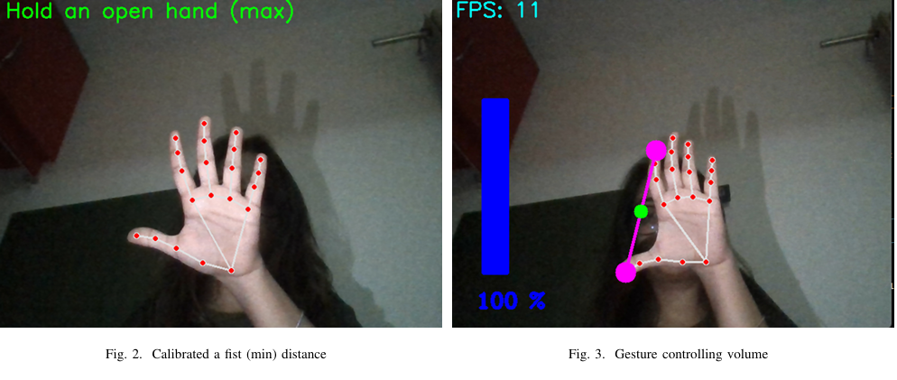

# VolumeAdjustmentControl
A vision-based real-time hand gesture system enables personalized, touchless volume control.

OVERVIEW : This project presents an intelligent vision-based real-time hand gesture recognition system that enables users to control volume levels using natural hand gestures — eliminating the need for physical interaction. The system uses computer vision and deep learning techniques to recognize specific hand movements and adjusts volume dynamically in response. It is designed to be personalized, intuitive, and touchless, ensuring a hygienic and futuristic user experience.

FEATURES :
-  Real-time hand detection and gesture tracking  
-  Distance-based gesture mapping to control system volume  
-  Touchless interaction enhances accessibility  
-  Personalized tuning for different hand sizes and movement ranges  
-  Smooth and responsive control via system API
